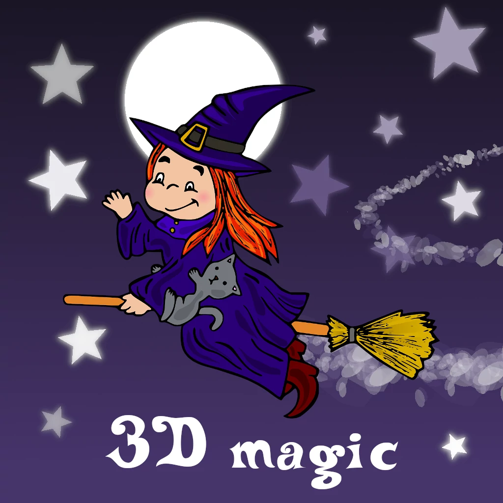

<style>
.gallery-grid {
    display: flex;
    flex-direction: row;
    flex-wrap: wrap;
    align-items: flex-end;
    justify-content: space-evenly;
}

.gallery-item {
    text-align: center;
    padding: 0;
}

.gallery-item img {
    width: 100%;
    image-rendering: pixelated;
}

@media screen and (min-width: 600px) {
    .gallery-item {
        flex-basis: 40%;
    }
}

@media screen and (min-width: 1220px) {
    .gallery-item img {
        transition: transform 0.25s, opacity 0.25s;
        opacity: 0.9;
    }
    .gallery-item img:hover {
        transform: scale(1.125);
        opacity: 1.0;
    }
}
</style>

# WebAR Demo gallery

Here you'll find some cool examples of what you can do with MARTINS.js. Simply click on a link or scan any of the QR codes below. After opening the web pages, scan the [target image](#target-image). In addition, please read the [guidelines](#guidelines).

## Basic demos

The following demos will help you get started:

<div class="gallery-grid" markdown>
<div class="gallery-item" markdown>
[](/martins-js/demos/hello-aframe){ ._blank }

**MARTINS.js + AFRAME**

[Launch demo](/martins-js/demos/hello-aframe){ ._blank } | [View the code](https://github.com/alemart/martins-js/tree/master/demos/hello-aframe){ ._blank }
</div>
<div class="gallery-item" markdown>
[](/martins-js/demos/hello-three){ ._blank }

**MARTINS.js + THREE.js**

[Launch demo](/martins-js/demos/hello-three){ ._blank } | [View the code](https://github.com/alemart/martins-js/tree/master/demos/hello-three){ ._blank }
</div>
<div class="gallery-item" markdown>
[](/martins-js/demos/hello-webgl){ ._blank }

**MARTINS.js + pure WebGL**

[Launch demo](/martins-js/demos/hello-webgl){ ._blank } | [View the code](https://github.com/alemart/martins-js/tree/master/demos/hello-webgl){ ._blank }
</div>
<div class="gallery-item" markdown>
[](/martins-js/demos/touch-interaction){ ._blank }

**Touch interaction with THREE.js**

[Launch demo](/martins-js/demos/touch-interaction){ ._blank } | [View the code](https://github.com/alemart/martins-js/tree/master/demos/touch-interaction){ ._blank }
</div>
</div>

## Minimal demos

Explore the source code with these minimalistic demos:

<div class="gallery-grid" markdown>
<div class="gallery-item" markdown>
[](/martins-js/demos/hello-world){ ._blank }

**Hello, world!**

[Launch demo](/martins-js/demos/hello-world){ ._blank } | [View the code](https://github.com/alemart/martins-js/tree/master/demos/hello-world){ ._blank }
</div>
<div class="gallery-item" markdown>
[](/martins-js/demos/simple-webcam){ ._blank }

**Simple Webcam demo**

[Launch demo](/martins-js/demos/simple-webcam){ ._blank } | [View the code](https://github.com/alemart/martins-js/tree/master/demos/simple-webcam){ ._blank }
</div>
</div>

## Guidelines

You can use a webcam or a video file as input. Click on the 🎥 icon at the top-right corner of the screen to toggle webcam input. When using a webcam:

* Avoid low-quality cameras. A camera of a typical smartphone is probably good enough.
* Don't move the camera nor the target image too quickly. This produces motion blur.
* Make sure that the physical environment is properly illuminated.
* The target image should appear clearly in the video.
* If you're scanning the image on a screen, make sure to adjust the brightness. If the screen is too bright (too dark), it will cause overexposure (underexposure) in the video and tracking difficulties - details of the images will be lost. Screen reflections are also undesirable.
* If you print the image, avoid shiny materials (e.g., glossy paper). They may generate artifacts in the image and interfere with the tracking. Prefer non-reflective materials.

## Try locally

Try the demos on your own machine:

1. Run on a console:

```sh
git clone git@github.com:alemart/martins-js.git
cd martins-js
npm start
```

2. Open [https://localhost:8000/demos/](https://localhost:8000/demos/)
3. Pick a demo and have fun!

## Target image

[](./assets/my-reference-image.webp "Based on free image by ArtRose from https://pixabay.com/pt/vectors/bruxa-vassoura-gato-chap%c3%a9u-magia-5635225/"){ ._blank }