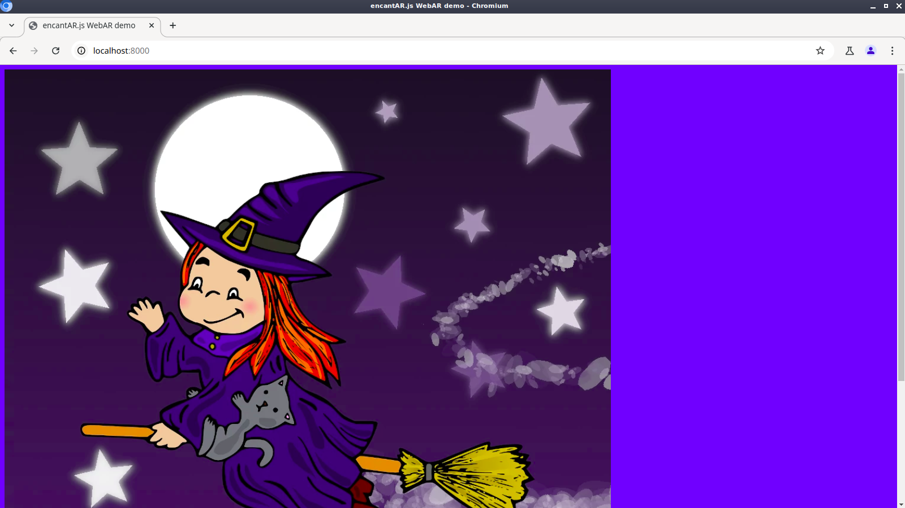

# Set up the tracker

In this section we'll learn how to set up the tracker. Later on we'll see how to use the tracker to track an image in a video, with its position and orientation in 3D.

## Add a reference image

The first thing we need to do is add the image we want to track to our web page. We'll be calling that a **reference image**. We simply pick a suitable image and add an `` tag to the page.

Not all images are suitable for tracking. Images should be distinct, detailed and asymmetrical. I discuss this in detail in [Guidelines for Images](./guidelines-for-images.md). For now we'll just use the following image:

<figure markdown>
[{ width=512 }](../assets/my-reference-image.webp){ ._blank }
<figcaption>Reference Image</figure>
</figure>

Download the image to the `ar-demo/` folder. Save it as [my-reference-image.webp](../assets/my-reference-image.webp){ ._blank }.

Next, let's add the reference image to our web page. Add an `` tag to the `<body>` of the page as follows:

```html title="index.html" hl_lines="11"
<!doctype html>
<html>
    <head>
        <meta charset="utf-8">
        <meta name="viewport" content="width=device-width,initial-scale=1">
        <title>encantar.js WebAR demo</title>
        <script src="encantar.js"></script>
        <style>body { background-color: #3d5afe; }</style>
    </head>
    <body>
        
    </body>
</html>
```

Reload the page. You should see the reference image:

<figure markdown>
[](../img/page-with-reference-image.webp){ ._blank }
<figcaption>Reference image in a web page</figcaption>
</figure>

If you don't see the image, make sure that there are no errors in the filename.

Once you see that the image is being properly loaded, there is no need to keep it visible. Let's add the `hidden` attribute to the `` tag:

```html title="index.html" hl_lines="11"
<!doctype html>
<html>
    <head>
        <meta charset="utf-8">
        <meta name="viewport" content="width=device-width,initial-scale=1">
        <title>encantar.js WebAR demo</title>
        <script src="encantar.js"></script>
        <style>body { background-color: #3d5afe; }</style>
    </head>
    <body>
        
    </body>
</html>
```

## Add a test video

We're going to be tracking that reference image in a test video. Please save the following video as [my-video.webm](../assets/my-video.webm){ ._blank } and [my-video.mp4](../assets/my-video.mp4){ ._blank } in `ar-demo/`. Later on I'll tell you how to use your webcam instead.

<figure markdown>
<video style="width:600px" controls muted loop playsinline autoplay oncanplay="this.muted=true;this.play()">
    <source src="../../assets/my-video.webm" type="video/webm" />
    <source src="../../assets/my-video.mp4" type="video/mp4" />
</video>
</figure>

This is the expected directory structure at this point:

    ar-demo/
    ├── index.html
    ├── encantar.js
    ├── my-reference-image.webp
    ├── my-video.mp4
    └── my-video.webm

Let's include the test video in our page. Add a `<video>` tag as follows:

```html title="index.html" hl_lines="12-15"
<!doctype html>
<html>
    <head>
        <meta charset="utf-8">
        <meta name="viewport" content="width=device-width,initial-scale=1">
        <title>encantar.js WebAR demo</title>
        <script src="encantar.js"></script>
        <style>body { background-color: #3d5afe; }</style>
    </head>
    <body>
        
        <video id="my-video" hidden muted loop playsinline autoplay>
            <source src="my-video.webm" type="video/webm" />
            <source src="my-video.mp4" type="video/mp4" />
        </video>
    </body>
</html>
```

## Instantiate an Image Tracker

In order to track the reference image in our video, we need an Image Tracker. Remember that a tracker is a subsystem of the WebAR engine that analyzes input data in some way. An Image Tracker is a tracker that finds and tracks reference images in a video stream.

Before we track anything with an Image Tracker, we must tell it what to track. There are two steps to this: first, we instantiate an Image Tracker. Next, we link our reference image to it.

We'll be writing a little bit of JavaScript code now. In order to keep our code clean, we'll be writing the JavaScript code to a new file. Let's add a `<script>` tag below `encantar.js` as follows:

```html title="index.html" hl_lines="8"
<!doctype html>
<html>
    <head>
        <meta charset="utf-8">
        <meta name="viewport" content="width=device-width,initial-scale=1">
        <title>encantar.js WebAR demo</title>
        <script src="encantar.js"></script>
        <script src="ar-demo.js"></script>
        <style>body { background-color: #3d5afe; }</style>
    </head>
    <body>
        
        <video id="my-video" hidden muted loop playsinline autoplay>
            <source src="my-video.webm" type="video/webm" />
            <source src="my-video.mp4" type="video/mp4" />
        </video>
    </body>
</html>
```

Create a new file called `ar-demo.js` and store it in the `ar-demo/` folder. Write the following contents to it:

```js title="ar-demo.js"
window.onload = async function()
{
    try {
        if(!AR.isSupported()) {
            throw new Error(
                'This device is not compatible with this AR experience.\n\n' +
                'User agent: ' + navigator.userAgent
            );
        }

        const tracker = AR.Tracker.ImageTracker();
    }
    catch(error) {
        alert(error.message);
    }
};
```

The `AR` namespace holds the various elements featured by the engine. We'll be using it extensively.

encantar.js only requires standard web technologies that have been around for a while. Still, it's a good practice to check if those technologies are supported by the target system. If they are not, we display a message and quit. If they are, we instantiate an Image Tracker.

Before moving on, make sure that you have the following directory structure at this point:

    ar-demo/
    ├── ar-demo.js
    ├── index.html
    ├── encantar.js
    ├── my-reference-image.webp
    ├── my-video.mp4
    └── my-video.webm

## Link the image to the tracker

Our Image Tracker has an internal database of reference images that it's capable of tracking. We call it a **reference image database**. To link a reference image to the tracker means to add that image to the database.

When linking a reference image to the tracker, the appropriate `HTMLImageElement` must be provided to the database. You may optionally assign a name to the image, so that you can identify it later on. If you don't, an automatically generated name will be assigned for you.

Let's link the image to the tracker. Add the following code to `ar-demo.js`:

```js title="ar-demo.js" hl_lines="12-15"
window.onload = async function()
{
    try {
        if(!AR.isSupported()) {
            throw new Error(
                'This device is not compatible with this AR experience.\n\n' +
                'User agent: ' + navigator.userAgent
            );
        }

        const tracker = AR.Tracker.ImageTracker();
        await tracker.database.add([{
            name: 'my-reference-image',
            image: document.getElementById('my-reference-image')
        }]);
    }
    catch(error) {
        alert(error.message);
    }
};
```

Reload the page. If you see no errors popping up, it means that the image is linked to the tracker. You're ready to proceed!